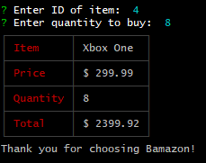
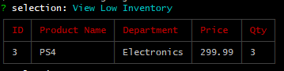
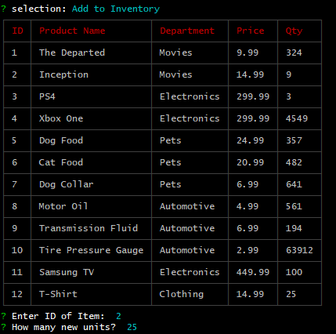
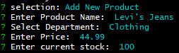
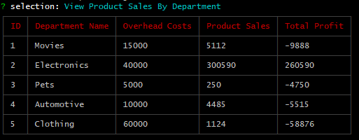
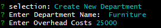

# Bamazon

Bamazon is a CLI based storefront running on Node.js.

## Organization

The app runs in a CLI or Terminal, and uses MySQL as its datastore. The program itself is organized into modules separating database, table, and main program functions.

## Running the app

Running this app requires [Node.js](https://www.nodejs.org) and [MySQL](https://www.mysql.com/) to be installed on your system.

1. Clone this repository to your local machine
2. Run `npm install` to install the required modules
3. Create a `.env` file in the root directory of the project, and supply the following variables:
    - `DB_HOST` -- The host of your MySQL database
    - `DB_USER` -- MySQL username
    - `DB_PASS` -- MySQL password
4. Run the `schema.sql` and `seeds.sql` (optional) scripts in your database. These will ensure the schema is in place.
5. Now you are ready to run the app, using one of:
    - `bamazonCustomer.js`
    - `bamazonManager.js`
    - `bamazonSupervisor.js`

## Usage

### Customer

The customer interface lets you choose and item to purchase, and the quantity of said item.

### Manager

Manager has four different functions:

1. View Products For Sale
    - This displays a table in the terminal with all products listed (same as in the Customer section)
2. View Low Inventory
    - Displays a table of any item in which less than 5 remain in stock.
    
3. Add to Inventory
    - Allows you to increase the remaining stock of any item
    
4. Add New Product
    - Provides the interface for adding an entirely new item to inventory
    

### Supervisor

Supervisor has two functions:

1. View Product Sale By Department
    - Prints a table to the terminal showing all departments, their overhead costs, total product sales, and total profit
    
2. Create New Department
    - Allows the creation of a new department
    
    

## Technologies Used
<b>Built With</b>
* [Node.js](https://www.nodejs.org)
    - [inquirer](https://www.npmjs.com/package/inquirer)
    - [mysql](https://www.npmjs.com/package/mysql)
    - [cli-table](https://www.npmjs.com/package/cli-table)
    - [dotenv](https://www.npmjs.com/package/dotenv)
* [MySQL](https://www.mysql.com)

## Future Development

For future work, I would like to make better use of `Promise`s in the `db` module. The purpose would be to explicitly send data to the `tables` module from the main files, as opposed to forcing tables to be printed direct from the `db` module.

## Credits

- <b>Developed By</b>: Will Parks -- [wparks08](https://www.github.com/wparks08)